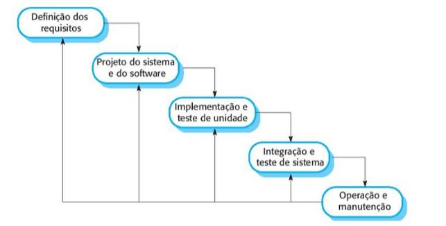
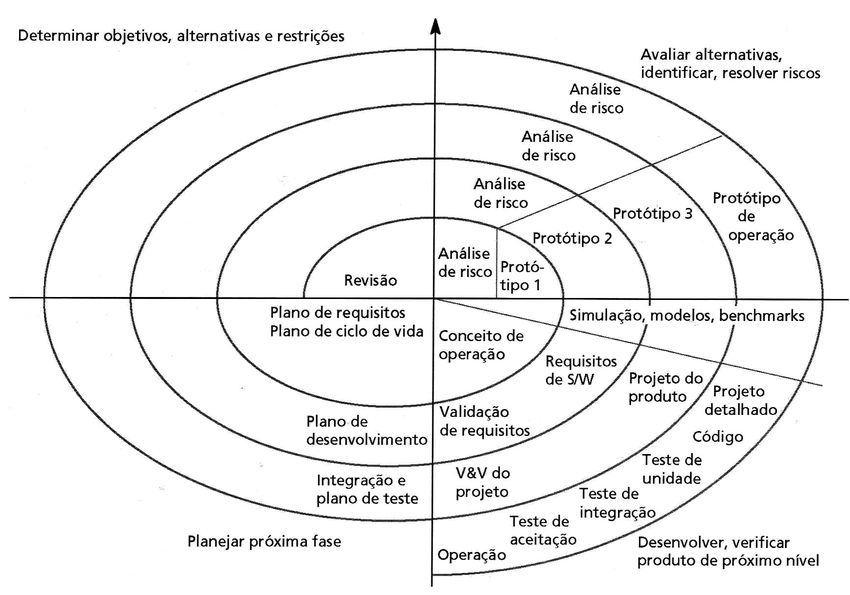

# Desafio

Imagine que você acabou de fundar uma empresa de desenvolvimento de
software. Então, agora, você precisa contratar a equipe que vai trabalhar 
desenvolvendo os sistemas de software que a sua empresa vai construir para os
clientes. Para isso, você contrata vários profissionais que são ótimos
programadores, que dominam tudo de programação, sabem codificar muito, usando
as linguagens e ambientes de programação mais atuais. Mas, basicamente, a
experiência deles é apenas essa, ou seja, eles sabem programar muito bem, são
feras de programação! Será que a sua empresa terá sucesso no desenvolvimento
dos softwares que seus clientes precisam?

# Videoaula 1 - Introdução à Engenharia de Software 
## O que é a engenharia de software?
É uma disciplina de engenharia que tem como objetivo a produção de software,
da sua concepção inicial, até a operação e manutenção.

## O que é o software?
São programas e documentação associados entre si, desenvolvidos para um
determinado cliente ou para uma organização.

## Quais atributos de um bom software? 
Funcionalidade e desenpenho aceitáveis, bem como facilidade para a manutenção,
usável e confiável por seu desenpemho.

## Quais as atividades fundamentais da Engenharia de Software?
- Especificação
- Desenvolvimento
- Validação
- Evolução do software

## Diferença entre Engenharia de Software e Ciências da Computação
- **Ciências da Computação** - trata da teoria e fundamentos da computação.
- **Engenharia de Software** - trata das questões práticas do desenvolvimento 
do software.

## Diferença entre Engenharia de Software e Engenharia de Sistemas
- **Engenharia de Sistemas** - trata do desenvolvimento de sistemas computacionais,
inclindo hardware, software e engenharia de processos.
- **Engenharia de Software** - faz parte do processo da engenha de sistemas de 
modo geral.

## Principais desafios da Engenharia de Software.
- Diversidade
- Demanda por menores prazos
- Softwares confiáveis

## Métodos e técnicas de engenharia de software
Não há métodos e técnicas que sejam bons o suficiente para todos os casos, como
exemplo, métodos e técnicas para o desenvolvimento de jogos que fazem uso de
**protótipos** e sistemas de controle críticos que precisa de desenvolvimento de
especificações completa e analisável.

## Diferenciais que a internet trouxe para a Engenharia de Software
A **internet** não somente impulsionou a economia do software no que diz 
respeito ao desenvolvimento de sistemas largamente distribuidos, mas ajudou no 
desenvolvimento da industria de aplicativos para dispositivos móveis.

## Um bom software precisa de?
- Aceitabilidade
	- aceitavél para todo tipo de usuário e compatível com outros sistemas.
- Dependabilidade e segurança da informação
	- confiabilidade, segurança da informação (security) e segurança (safety), 
	não causando prejuizos físicos e/ou econõmico quando falhar, seguido de 
	proteção contra 
	usuários maliciosos.
- Eficiência
	- Eficiência inclui excelente uso de memória e processamento e  responsividade.
- Manutenibilidade
	- Softwares bem escritos que permite facíl manutenção e expansão de suas 
	funcionalidades para evoluir conforme cresce suas necessidades.

## Tipos de software
- Aplicações interativas baseadas em transações
- Aplicações stand-alone
- Sistemas de controle embarcado
- Sistemas de processamento em lote (batch)
- Sistemas de entretenimento
- Sistemas para modelagem e simulação
- Sistemas de coleta e 
 
 
SOMMERVILLE, I. [Engenharia de Software](https://www.bvirtual.com.br/NossoAcervo/Publicacao/168127). 10. ed. São Paulo:
Pearson Education do Brasil, 2018.

# Texto-base 1 - Engenharia de Software (Leia o Capítulo 1, páginas 3-13) | Ian Sommerville

A Engenharia de Software é essencial para o funcionamento da sociedade moderna, 
pois todas as instituições governamental e privadas estão conectados de alguma 
forma por meio
 de um software. 
Sistemas financeiros, governos, área de entretenimento como a de música, jogos 
eletrônicos, fazem uso de algum tipo de software.
Os sistemas de software são difícies de entender e não podem ser tocados pois 
não seguem padrões da física, ou dos meios de produção tradicionais, tornando-os 
complexos e caros 
 modificar. 	
Não existem técnicas e métodos padrões para o desenvolvimento de um software, 
mesmo que dos mais simples. Pois cada tipo de sistema apesar de precisar de uma 
engenharia para o 
seu desenvolvimento, faz-se uso de tecnica e métodos diferentes.
Falhas no desenvolvimento de software podem estar relacionadas a: 
- complexidade crescente dos sistemas
	-	Apesar das técnicas de engenhariaa de software facilitar a construir 
	sistemas melhores, as demanda mudam, e por isso novas técnicas de engenharia 
	precisam ser desenvolvidas para enfrentar nos novos desafios. 
- ausência de métodos de engenharia de sofware
	- Métodos de engenharia de software tem sido ignorados na maioria dos
	projetos, causando encarecimento do produto e tornando-o menos confiável, 
	gerando necessidade 
	treinamento especializado em engenharia de software para resolver este problema. 

Sem a engenharia de sofware, não teriamos feito grandes avanços como a da 
exploração espacial, tornando as viagens mais seguras. Porém, atualmente 
enfrentamos grandes desafios 
 as mudanças climáticas, excasses de recursos naturais, variacções demográficas 
 e aumento da 
população mundial como exemplos. 

## Desenvolvimento profissional de software
Entendemos que a **engenharia de software** tem como objetivo o desenvolvimento 
de software profissional, e não a programação individual. 
Para isso, é necessário que algumas questões sejam entendidas a saber:

-	O que é o software?
	- São programas e documentação de computadores
- Quais os atributos de um bom software?
	- Deve ser funcional com desempenho aceitável, manutenível, usável e com 
	dependábilidade.
- o que é engenharia de software
	- É uma disciplina de engenharia de software, que abrange do projeto inicial, 
	operação e manutenção.
- Atividades fundamentais da engenharia de software?
	- Especificação, desenvolvimento, validação e evolução do software
- Qual a diferença entre **engenharia de software** e **ciências da computação**?
	- Ciências da computação abrange fundamentos e teorias e engenharia de 
	software com questões práticas do desenvolvimento e entrega do software
- 	Qual a diferença entre **engenharia de software** e **engenharia de sistemas**?
	- engenharia de sistemas abrange aspectos do desenvolvimento de sistemas 
	computacionais incluindo hardware, software e engenharia de processos, e a 
	engenharia de software esta dentro deste processo.
- Quais os custos da engenharia de sofware? 
	- 60% desenvolvimento
	- 40% testes
	- software personalizados, geralmentee ultrapassam os de desenvolvimento
- Quais melhores métodos e técnicas de engenharia de sofware?
	- técnicas diferentes, para tipos de software diferentes.
- Quais diferenciais a engenharia de sofware trouxe para a engenharia de software?
	- deu base para a criação da industria de aplicativos móveis.

Engenharia de software abrange o desenvolvimento de software, documentação,
bibliotecas, websites de apoio	e dados de configuração asociados.
Na engenharia de software, se destaca dois tipos de produtos
- **produtos genéricos**(stand-alone) são softwares desenvolvimento por alguma 
organização, com total controle das especificações do software, e comercializados 
como exemplo
um sistemas financeiros, etc.
- **software personalizado** são desenvolvidos para um determinado cliente que 
conntrola as especificações do software, como exemplo  controle para dispositivos 
eletrônicos, etc.

No entanto, **produtos genéricos** e  **software personalizado** estão cada vez 
mais difícil de ser distinguidos, como é o caso dos sistemas de **ERP**.
A qualidade do software envolve o comportamento do software enquanto em execução, 
a estrutura e organização dos programas, incluindo sua documentação. 
Estas especificações varim de acordo com o tipo de software como exemplo um softwae 
de controle de aeronaves, devem ser seguros, e se for um jogo, deve ser responsivos.

## Atributos de um software
- Aceitabilidade
	- ser aceitavel para o tipo de usuário, sendo inteligível e compatível com
	outros sistemas do usuário
- Dependabilidade e segurança
	- confiabilidade e segurança que garante o não prejuizo fisíco e/ou econômico
- Eficência
	- não disperdício de recursos de memória, processamento etc.
- Manutenibilidade
	- software bem escrito para que evolua conforme a satisfação e necessidades
	do cliente

## Engenharia de sofware
Esta relacionado a todo aspecto da disciplina da engenharia de software que se
define em;
- Disciplina de engenharia
	- aplicação de teorias, métodos e ferramentas apropriadas, para descobrir
	soluções para problemas mesmo quando não havendo teorias e métodos aplicáveis.
- Aspectos da produção de software
	- inclui atividades de gerenciamento de projetos, desenvolvimento de
	ferramentas, métodos e teorias que apoie o desenvolvimento do software.

Engenharia de software, é a busca da qualidade do software, que atenda ao
cronograma e ao orçamento estipulados.
Como sociedade, dependemos de sistemas de software avançados e confiáveis.
Métodos de engenharia de software torna o produto final mais barato, melhor
qualidade e de manutenção a longo prazo.
O processo do software inclui quatro processos a saber:
- Especificação
	- etapas em que clientes e engenheiros definem o que deve ser produzido
- Desenvolvimento
	- etapa de projeto e desenvolvimento
- Evolução
	- modificações que reflita requisitos tanto do cliente como do mercado

Temos a considerar quatro questões que afetam os variados tipos de sofware,
pois modos e técnicas variam conforme seu tipo.
- Heterogeneidade
	- sistemas distribuidos em redes que atendam os diferentes tipos de computadores e dispositivos móveis.
- Mudanças nos negócios e na sociedade
	- muitas técnicas de desenvolvimento de software são demoraadas, o que não
	atende a entrega de um sistema com qualidade no curto prazo.
- Segurança da informação
	- Software confiavél e seguro, garantindo proteção dos dados.
- Escala
	- Sistemas que atenda a demanda mundial, como a computação em nuvem

## Diversidade da engenharia de software
[SEMAT](https://www.semat.org/) é a base para a melhoria dos métodos de
engenharia de software, pois não ha um método único para ser usado.  O tipo de
aplicação, define o tipo de método a ser usado e/ou criado.
- Aplicação standalone
	- são sistemas executados em um computador pessoal ou mobile como CAD,
	manipulador de imagem, app de viagem etc.
- Aplicações interativas baseadas em transição
	- aplicações executadas em computadores remotos e acessados por aplicativos
	de usuários como as de comércio eletrônicos.
- Sistemas de controle embarcados
	- são sistema que gerencicam dispositivos de hardware como os sistemas ABS
	de um carro, forno microondas etc.
- Sistema de processamento em lote
	- sistemas que processam grandes quantidad de dados como sistemas de
	pagamento, contas de telefones etc.
- Sistemas de entretenimentos
	- sistemas de jogos são exemplos tipicos de sistemas de entretenimentos

- Sistemas de modelagem e simulação
	- sistemas que modelam processos físicos desenvolvidos por cientistas e
	engenheros.
- Sistemas de coleta de dados análise
	- sistemas como as que coletam dados a partir de sensores e enviam para
	outros sistemas para análise como a de Big Data
- Sitemas de sistemas
	- Series de sistemas como ERP's .

# Fundamentos da engnharia de software que se aplica a todos os tipos de sofware
- uso de um processo gerenciado e compreendido para que idéias claras do que
será produzido e quanto da conclusão. 
- dependabilidade e desenpenho que garanta que o software se comporte como o
esperado com bom desenpenhos e uso de recursos fisicos.
saber lidar com diferentes clientes e usuários e fazer o gerenciamento destas
expectativas.
- reusar softwares de mmodo eficaz em vez de escrever outro.

## Engenharia de software para a internet
De um grande depósito de informação, a internet passou a oferecer cada vez mais
tecnologias sofisticas que permite o uso de sistemas inovadores acessados pela
internet.
Podendo desenvolver uma aplicação e hospedar em um servidor, barateando o
acesso a tecnologias e serviços.

# Videoaula 2 - Modelos de processo de software 
Engloba as atividades importantes para especificações, desenvolvimento,
validação e evolução do software.
São varios os modelos de processos de softwares a saber.
-  modelos de processos de softwares
	- Modelo em cascatas
	- Modelo de Boehm
	- Modelo incremental

# Texto-base 2 - Engenharia de Software (Leia o Capítulo 2, páginas 29-46) | Ian Sommerville

Processo de software são atividades relacioandas ao desenvolvido de um sistema de software. São quatro as atividades obrigatórias a seguir no processo da atividade de software.
- Especificação
	- definir as funcionalidades e especificações do software
- Desenvolvimento
	- softwares que atende as espeficicações 
- Validação
	- garantia que o software atenda as expectativas do cliente
- Evolução
	- evolução do software para que atenda as necessidades dos clientes

São atividades complexas que incluem gerenciamento de configuração do software e 
planejamento como apoio a produção do software.
- O processo do software demanda entender quem esta envolvido, o que esta sendo
produzido as condições que influência estas atividades.
- Este envolvimento abrange o gerente do projeto, gerente de configuração e do
programador.
- Condições que devem ser atendidas antes e depois de aprovadas como aprovação
de todos os requisitos pelo cliente e modelos UML revistados e alterados etc.

Como não há um processo **universal**, a maioria das empresas concebeu seus
próprios modelos de processos com base em experiẽncias de seus desenvolvedores.
Sempre haverá espaços para melhorias dos processos como as técnicas ultrapassadas
ou mesmo de práticas consideradas mais adequadas para a engenharia de industrial.

## Modelos de processo de software
(SDLC) é uma visão genérica do desenvolvimento de um sistema de software. É uma visão abstrata do processo de desenvolvimento de software que pode ser ampliada
conforme demanda necessidades espeficicas de cada projeto.
Segue abaixo, uma breve descrição dessa abstração para o modelo de processo de software.

- Modelo em cascatas
	- atividades de desenvolvimento, validação e evolução no processo de desenvolvimento do software como especificação de requisitos, projeto,
	implementação e testes.
- Desenvolvimento incremental
	- atividades de especificação, desenvolvimento e validação
- Integração e configuração
	- disponibilidade de conponentes e reuso de componentes de softwares

Quando falamos em modelo genérico de desenvolvimento de software, estamos
falando do reuso dos módulos de outros softwares, pois como citado, não existe
um modelo universão para o desenvolvimento do software. Cada tipo de sistema, 
tem suas necessidades particulares, e métodos e técnicas serão sempre diferentes.
RUP é a tentativa de implantar um modelo universão para o desenvolvimento de
software. Empresas como IBM tentaram com baixa aceitação deste modelo.

## Modelo de cascata
É conhecido como um processo rígido pois o processo de desenvolvimento de software
aqui é criado em estágios de cascatas.

Referẽncia da imagem: Engenharia de Software, Página 33, | Ian Sommerville.
- Análise de definição de requisitos
	- serviços, restrições e metas sob consulta do usuário para especificação
	do projeto.
- Projeto do sistema do software
	- identificar e descrever as abstrações de software e hardware para as espeficicações do projeto.
- implementação e teste de unidade
	- verificação de cada unidade dos módulos do software se satisfazem as
	especificações do projeto
- Integração e teste de sistema
	- as unidades do software são integradas e testadas para garantir que os 
	requisitos sejam atendidos, e se sim, entregue ao cliente.
- Operação de manutenção
	- o sistema é colocado em modo de produção (uso), e conforme novos
	requisitos aparecem, são adicionados e corrigidos

## Modelo de processo espiral de Boehm

Fonte da imagem [Research Gate](https://www.researchgate.net/figure/Figura-20-Modelo-de-processo-de-desenvolvimento-em-espiral-proposto-por-Boehm_fig15_317087042)

O *modelo de processo espiral de Boehm* é um modelo dirigido por riscos. Aqui
define uma consequência de riscos a cada volta na espiral do projeto, mas
inclui atividades para o gerenciamento do projeto.

