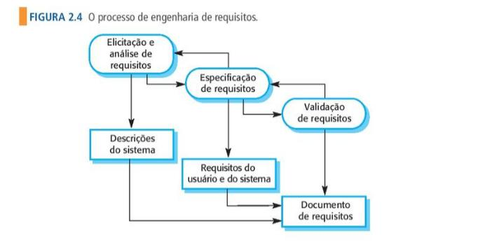
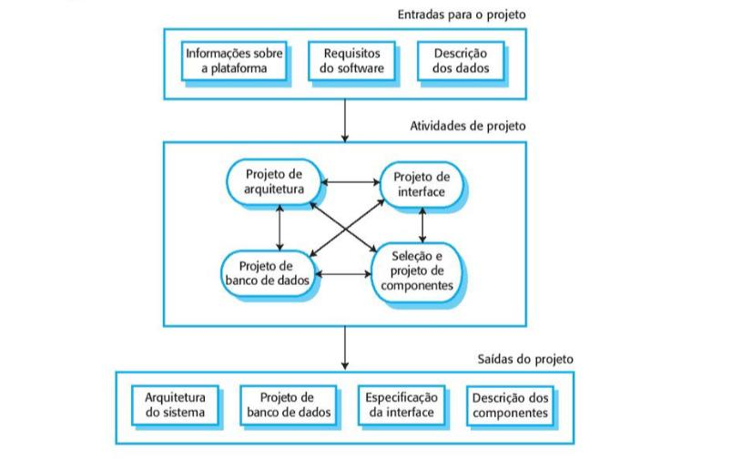
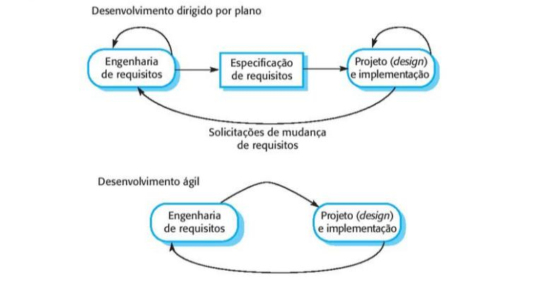
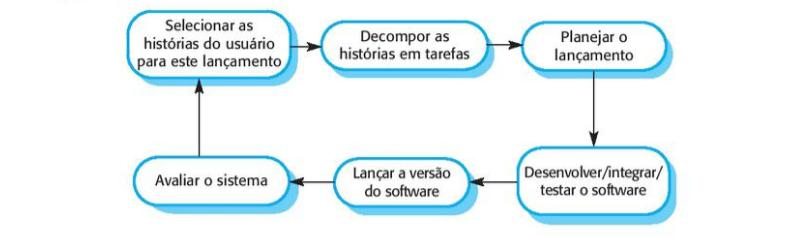

# Desafio

Imagine que você acabou de fundar uma empresa de desenvolvimento de
software. Então, agora, você precisa contratar a equipe que vai trabalhar 
desenvolvendo os sistemas de software que a sua empresa vai construir para os
clientes. Para isso, você contrata vários profissionais que são ótimos
programadores, que dominam tudo de programação, sabem codificar muito, usando
as linguagens e ambientes de programação mais atuais. Mas, basicamente, a
experiência deles é apenas essa, ou seja, eles sabem programar muito bem, são
feras de programação! Será que a sua empresa terá sucesso no desenvolvimento
dos softwares que seus clientes precisam?

# Videoaula 1 - Introdução à Engenharia de Software 
## O que é a engenharia de software?
É uma disciplina de engenharia que tem como objetivo a produção de software,
da sua concepção inicial, até a operação e manutenção.

## O que é o software?
São programas e documentação associados entre si, desenvolvidos para um
determinado cliente ou para uma organização.

## Quais atributos de um bom software? 
Funcionalidade e desenpenho aceitáveis, bem como facilidade para a manutenção,
usável e confiável por seu desenpemho.

## Quais as atividades fundamentais da Engenharia de Software?
- Especificação
- Desenvolvimento
- Validação
- Evolução do software

## Diferença entre Engenharia de Software e Ciências da Computação
- **Ciências da Computação** - trata da teoria e fundamentos da computação.
- **Engenharia de Software** - trata das questões práticas do desenvolvimento 
do software.

## Diferença entre Engenharia de Software e Engenharia de Sistemas
- **Engenharia de Sistemas** - trata do desenvolvimento de sistemas computacionais,
inclindo hardware, software e engenharia de processos.
- **Engenharia de Software** - faz parte do processo da engenha de sistemas de 
modo geral.

## Principais desafios da Engenharia de Software.
- Diversidade
- Demanda por menores prazos
- Softwares confiáveis

## Métodos e técnicas de engenharia de software
Não há métodos e técnicas que sejam bons o suficiente para todos os casos, como
exemplo, métodos e técnicas para o desenvolvimento de jogos que fazem uso de
**protótipos** e sistemas de controle críticos que precisa de desenvolvimento de
especificações completa e analisável.

## Diferenciais que a internet trouxe para a Engenharia de Software
A **internet** não somente impulsionou a economia do software no que diz 
respeito ao desenvolvimento de sistemas largamente distribuidos, mas ajudou no 
desenvolvimento da industria de aplicativos para dispositivos móveis.

## Um bom software precisa de?
- Aceitabilidade
	- aceitavél para todo tipo de usuário e compatível com outros sistemas.
- Dependabilidade e segurança da informação
	- confiabilidade, segurança da informação (security) e segurança (safety), 
	não causando prejuizos físicos e/ou econõmico quando falhar, seguido de 
	proteção contra 
	usuários maliciosos.
- Eficiência
	- Eficiência inclui excelente uso de memória e processamento e  responsividade.
- Manutenibilidade
	- Softwares bem escritos que permite facíl manutenção e expansão de suas 
	funcionalidades para evoluir conforme cresce suas necessidades.

## Tipos de software
- Aplicações interativas baseadas em transações
- Aplicações stand-alone
- Sistemas de controle embarcado
- Sistemas de processamento em lote (batch)
- Sistemas de entretenimento
- Sistemas para modelagem e simulação
- Sistemas de coleta e 
 
 
SOMMERVILLE, I. [Engenharia de Software](https://www.bvirtual.com.br/NossoAcervo/Publicacao/168127). 10. ed. São Paulo:
Pearson Education do Brasil, 2018.

# Texto-base 1 - Engenharia de Software (Leia o Capítulo 1, páginas 3-13) | Ian Sommerville

A Engenharia de Software é essencial para o funcionamento da sociedade moderna, 
pois todas as instituições governamental e privadas estão conectados de alguma 
forma por meio
 de um software. 
Sistemas financeiros, governos, área de entretenimento como a de música, jogos 
eletrônicos, fazem uso de algum tipo de software.
Os sistemas de software são difícies de entender e não podem ser tocados pois 
não seguem padrões da física, ou dos meios de produção tradicionais, tornando-os 
complexos e caros 
 modificar. 	
Não existem técnicas e métodos padrões para o desenvolvimento de um software, 
mesmo que dos mais simples. Pois cada tipo de sistema apesar de precisar de uma 
engenharia para o 
seu desenvolvimento, faz-se uso de tecnica e métodos diferentes.
Falhas no desenvolvimento de software podem estar relacionadas a: 
- complexidade crescente dos sistemas
	-	Apesar das técnicas de engenhariaa de software facilitar a construir 
	sistemas melhores, as demanda mudam, e por isso novas técnicas de engenharia 
	precisam ser desenvolvidas para enfrentar nos novos desafios. 
- ausência de métodos de engenharia de sofware
	- Métodos de engenharia de software tem sido ignorados na maioria dos
	projetos, causando encarecimento do produto e tornando-o menos confiável, 
	gerando necessidade 
	treinamento especializado em engenharia de software para resolver este problema. 

Sem a engenharia de sofware, não teriamos feito grandes avanços como a da 
exploração espacial, tornando as viagens mais seguras. Porém, atualmente 
enfrentamos grandes desafios 
 as mudanças climáticas, excasses de recursos naturais, variacções demográficas 
 e aumento da 
população mundial como exemplos. 

## Desenvolvimento profissional de software
Entendemos que a **engenharia de software** tem como objetivo o desenvolvimento 
de software profissional, e não a programação individual. 
Para isso, é necessário que algumas questões sejam entendidas a saber:

-	O que é o software?
	- São programas e documentação de computadores
- Quais os atributos de um bom software?
	- Deve ser funcional com desempenho aceitável, manutenível, usável e com 
	dependábilidade.
- o que é engenharia de software
	- É uma disciplina de engenharia de software, que abrange do projeto inicial, 
	operação e manutenção.
- Atividades fundamentais da engenharia de software?
	- Especificação, desenvolvimento, validação e evolução do software
- Qual a diferença entre **engenharia de software** e **ciências da computação**?
	- Ciências da computação abrange fundamentos e teorias e engenharia de 
	software com questões práticas do desenvolvimento e entrega do software
- 	Qual a diferença entre **engenharia de software** e **engenharia de sistemas**?
	- engenharia de sistemas abrange aspectos do desenvolvimento de sistemas 
	computacionais incluindo hardware, software e engenharia de processos, e a 
	engenharia de software esta dentro deste processo.
- Quais os custos da engenharia de sofware? 
	- 60% desenvolvimento
	- 40% testes
	- software personalizados, geralmentee ultrapassam os de desenvolvimento
- Quais melhores métodos e técnicas de engenharia de sofware?
	- técnicas diferentes, para tipos de software diferentes.
- Quais diferenciais a engenharia de sofware trouxe para a engenharia de software?
	- deu base para a criação da industria de aplicativos móveis.

Engenharia de software abrange o desenvolvimento de software, documentação,
bibliotecas, websites de apoio	e dados de configuração asociados.
Na engenharia de software, se destaca dois tipos de produtos
- **produtos genéricos**(stand-alone) são softwares desenvolvimento por alguma 
organização, com total controle das especificações do software, e comercializados 
como exemplo
um sistemas financeiros, etc.
- **software personalizado** são desenvolvidos para um determinado cliente que 
conntrola as especificações do software, como exemplo  controle para dispositivos 
eletrônicos, etc.

No entanto, **produtos genéricos** e  **software personalizado** estão cada vez 
mais difícil de ser distinguidos, como é o caso dos sistemas de **ERP**.
A qualidade do software envolve o comportamento do software enquanto em execução, 
a estrutura e organização dos programas, incluindo sua documentação. 
Estas especificações varim de acordo com o tipo de software como exemplo um softwae 
de controle de aeronaves, devem ser seguros, e se for um jogo, deve ser responsivos.

## Atributos de um software
- Aceitabilidade
	- ser aceitavel para o tipo de usuário, sendo inteligível e compatível com
	outros sistemas do usuário
- Dependabilidade e segurança
	- confiabilidade e segurança que garante o não prejuizo fisíco e/ou econômico
- Eficência
	- não disperdício de recursos de memória, processamento etc.
- Manutenibilidade
	- software bem escrito para que evolua conforme a satisfação e necessidades
	do cliente

## Engenharia de sofware
Esta relacionado a todo aspecto da disciplina da engenharia de software que se
define em;
- Disciplina de engenharia
	- aplicação de teorias, métodos e ferramentas apropriadas, para descobrir
	soluções para problemas mesmo quando não havendo teorias e métodos aplicáveis.
- Aspectos da produção de software
	- inclui atividades de gerenciamento de projetos, desenvolvimento de
	ferramentas, métodos e teorias que apoie o desenvolvimento do software.

Engenharia de software, é a busca da qualidade do software, que atenda ao
cronograma e ao orçamento estipulados.
Como sociedade, dependemos de sistemas de software avançados e confiáveis.
Métodos de engenharia de software torna o produto final mais barato, melhor
qualidade e de manutenção a longo prazo.
O processo do software inclui quatro processos a saber:
- Especificação
	- etapas em que clientes e engenheiros definem o que deve ser produzido
- Desenvolvimento
	- etapa de projeto e desenvolvimento
- Evolução
	- modificações que reflita requisitos tanto do cliente como do mercado

Temos a considerar quatro questões que afetam os variados tipos de sofware,
pois modos e técnicas variam conforme seu tipo.
- Heterogeneidade
	- sistemas distribuidos em redes que atendam os diferentes tipos de
	computadores e dispositivos móveis.
- Mudanças nos negócios e na sociedade
	- muitas técnicas de desenvolvimento de software são demoraadas, o que não
	atende a entrega de um sistema com qualidade no curto prazo.
- Segurança da informação
	- Software confiavél e seguro, garantindo proteção dos dados.
- Escala
	- Sistemas que atenda a demanda mundial, como a computação em nuvem

## Diversidade da engenharia de software
[SEMAT](https://www.semat.org/) é a base para a melhoria dos métodos de
engenharia de software, pois não ha um método único para ser usado.  O tipo de
aplicação, define o tipo de método a ser usado e/ou criado.
- Aplicação standalone
	- são sistemas executados em um computador pessoal ou mobile como CAD,
	manipulador de imagem, app de viagem etc.
- Aplicações interativas baseadas em transição
	- aplicações executadas em computadores remotos e acessados por aplicativos
	de usuários como as de comércio eletrônicos.
- Sistemas de controle embarcados
	- são sistema que gerencicam dispositivos de hardware como os sistemas ABS
	de um carro, forno microondas etc.
- Sistema de processamento em lote
	- sistemas que processam grandes quantidad de dados como sistemas de
	pagamento, contas de telefones etc.
- Sistemas de entretenimentos
	- sistemas de jogos são exemplos tipicos de sistemas de entretenimentos

- Sistemas de modelagem e simulação
	- sistemas que modelam processos físicos desenvolvidos por cientistas e
	engenheros.
- Sistemas de coleta de dados análise
	- sistemas como as que coletam dados a partir de sensores e enviam para
	outros sistemas para análise como a de Big Data
- Sitemas de sistemas
	- Series de sistemas como ERP's .

# Fundamentos da engnharia de software que se aplica a todos os tipos de sofware
- uso de um processo gerenciado e compreendido para que idéias claras do que
será produzido e quanto da conclusão. 
- dependabilidade e desenpenho que garanta que o software se comporte como o
esperado com bom desenpenhos e uso de recursos fisicos.
saber lidar com diferentes clientes e usuários e fazer o gerenciamento destas
expectativas.
- reusar softwares de mmodo eficaz em vez de escrever outro.

## Engenharia de software para a internet
De um grande depósito de informação, a internet passou a oferecer cada vez mais
tecnologias sofisticas que permite o uso de sistemas inovadores acessados pela
internet.
Podendo desenvolver uma aplicação e hospedar em um servidor, barateando o
acesso a tecnologias e serviços.

# Videoaula 2 - Modelos de processo de software 
Engloba as atividades importantes para especificações, desenvolvimento,
validação e evolução do software.
São varios os modelos de processos de softwares a saber.
-  modelos de processos de softwares
	- Modelo em cascatas
	- Modelo de Boehm
	- Modelo incremental

# Texto-base 2 - Engenharia de Software (Leia o Capítulo 2, páginas 29-46) | Ian Sommerville

Processo de software são atividades relacioandas ao desenvolvimentdo de um sistema de
software. São quatro as atividades obrigatórias a seguir no processo da
atividade de software.
- Especificação
	- definir as funcionalidades e especificações do software
- Desenvolvimento
	- softwares que atende as espeficicações 
- Validação
	- garantia que o software atenda as expectativas do cliente
- Evolução
	- evolução do software para que atenda as necessidades dos clientes

São atividades complexas que incluem gerenciamento de configuração do software e 
planejamento como apoio a produção do software.
- O processo do software demanda entender quem esta envolvido, o que esta sendo
produzido as condições que influência estas atividades.
- Este envolvimento abrange o gerente do projeto, gerente de configuração e do
programador.
- Condições que devem ser atendidas antes e depois de aprovadas como aprovação
de todos os requisitos pelo cliente e modelos UML revistados e alterados etc.

Como não há um processo **universal**, a maioria das empresas concebeu seus
próprios modelos de processos com base em experiẽncias de seus desenvolvedores.
Sempre haverá espaços para melhorias dos processos como as técnicas ultrapassadas
ou mesmo de práticas consideradas mais adequadas para a engenharia de industrial.

## Modelos de processo de software
(SDLC) é uma visão genérica do desenvolvimento de um sistema de software. É uma
visão abstrata do processo de desenvolvimento de software que pode ser ampliada
conforme demanda necessidades espeficicas de cada projeto.
Segue abaixo, uma breve descrição dessa abstração para o modelo de processo de
software.

- Modelo em cascatas
	- atividades de desenvolvimento, validação e evolução no processo de
	desenvolvimento do software como especificação de requisitos, projeto,
	implementação e testes.
- Desenvolvimento incremental
	- atividades de especificação, desenvolvimento e validação
- Integração e configuração
	- disponibilidade de conponentes e reuso de componentes de softwares

Quando falamos em modelo genérico de desenvolvimento de software, estamos
falando do reuso dos módulos de outros softwares, pois como citado, não existe
um modelo universão para o desenvolvimento do software. Cada tipo de sistema, 
tem suas necessidades particulares, e métodos e técnicas serão sempre diferentes.
RUP é a tentativa de implantar um modelo universão para o desenvolvimento de
software. Empresas como IBM tentaram com baixa aceitação deste modelo.

## Modelo de cascata
É conhecido como um processo rígido pois o processo de desenvolvimento de software
aqui é criado em estágios de cascatas.

Referẽncia da imagem: Engenharia de Software, Página 33, | Ian Sommerville.
- Análise de definição de requisitos
	- serviços, restrições e metas sob consulta do usuário para especificação
	do projeto.
- Projeto do sistema do software
	- identificar e descrever as abstrações de software e hardware para as
	espeficicações do projeto.
- implementação e teste de unidade
	- verificação de cada unidade dos módulos do software se satisfazem as
	especificações do projeto
- Integração e teste de sistema
	- as unidades do software são integradas e testadas para garantir que os 
	requisitos sejam atendidos, e se sim, entregue ao cliente.
- Operação de manutenção
	- o sistema é colocado em modo de produção (uso), e conforme novos
	requisitos aparecem, são adicionados e corrigidos

Nesse modelo de requisitos, os processos se auto alimentam de novas informações
conforme as fases de requistos são satisfeitas. Estas novas informaçõs são
depois analisadas e incrementadas como melhorias ao projeto.
O modelo de cascata é ideial em projetos como;
- Sistemas enbarcados
	- software que interagem com sistemas de hardware.
- sistemas críticos
	- com ampla necessidade de análise crítica de segurança *(safety)* e 
	segurança da informação *(security)*.
- grandes sistemas de softwares
	- sistemas de engenharia em que várias empresas fazem parte do projeto.
Se os requisitos do software mudam rapidamente e a comunicação  com a equipe 
é informal, não se aplica este modelo, pois demanda um alto custo para
o desenvolvimento..

## Desenvolvimento incremental

Referẽncia da imagem: Engenharia de Software, Página 35, | Ian Sommerville.

É a abordagem mais comum para o desenvolvimento de software, por ser dirigida 
por plano. Plano aqui se refere as alterações no software com base nas necessidades
de atualizações e correções ao logo do desenvolvimento.
É uma abordagem mais barata e fácil para fazer alterações, o que pode ser feito
durante o processo de desenvolvimento. 
Veja abaixo as vantagens em relação ao modelo em cascatas.
- Custos
	- custos reduzidos para aplicar mudanças de requisitos como quantidade
	de análise e de documentação.
- Fácil obter
	- obter feedback por parte do cliente, por comentar as demostrações de
	softwares.
- Entrega e implantação
	- os clientes podem usar o software mesmo antes de finalizados.
## Problemas no desenvolvimento incremental
O principal problema é a burocracia das grandes organizações que é incompativel
com este procedimento e o processo ágil mais informal.
Como nem sempre podem ser mudadas devido a lei *Sarbanes-Oxly* nos EUA, os
conflitos do processo acabam por acontecer.
- o processo não é visível, sendo assim, difícil medir o progresso dos resultados.
- degradação da estrutura do sistema pois deixam o código bagunçado, o que
encarece seu custo.

## Integração e configuração
É normal na engenharia de software, o reuso de códigos de outros softwares. Isso
já vem acontecendo com frequência desde os anos 2000, e são em trêsos tipos de
conponentes a saber:
- Sistemas de aplicações
	- sistemas de uso geral que apesar de suas caracteristicas, precisam de
	adaptaçao para uma determinada aplicação
- Coleções de objetos
	- são componentes a ser integados a um framework
- Web Services
	- são padrões de serviços disponível remotamente na web

1. *Especificações de requisitos* que incluem descrições breves dos requisitos
essenciais e caractristicas de sistemas desejados.
2. 	*Descoberta e avaliação do software* em que é feito buscas pelos componentes
com base nos requisitos de especificações
3. *Refinamento dos requisitos* que são definidos com base nas nas informações
dos componentes reusáveis e das aplicações descobertas. 
4. *Configuração das aplicações* se satisfeitas os requisitos da aplicação, será 
utilizada para criação da apliacação. 
5. *Adaptação e integração dos componestes* em que não havendo aplicação disponível,
uma nova poderá ser usada e/ou mesmo aproveitar-se de alguns componentes.

Reuso do software, é muito importante pois reduz a quantidade de software a ser
a ser desenvolvido, e reduz o custo final do produto com entrega mais ráapida.
Ressaltamos que está técnica reduz o controle sobre a evolução do sistema, e 
pode haver necessidades que não venha a atender o usuário.  

## Atividade do processo do software
O processo do software são atividades técnicas colaborativas e gerenciais com único
objeto de criar e testar softwares.
Podendo fazer uso de sistemas de *gerenciamento de requisitos*, *editor de modelo de projeto*
*editor de programas*, *ferramentas de testes automatizados* e *depuradores*.

## Ferramentas de desenvolvimento de software
- gerenciadores de requisitos
- editores de projetos
- ferramentas de apoio a refatoração
- copiladores
- depuradores
- rastreadores de defeitos (bug tracks)
- ferramentas de construção de sistema

Todos são programas para apoio da atividade de *engenharia de software*. entre
uma das melhores caractristicaas das IDE's, é que elas incluem em sua maioria
quase ou todas as ferramentas necessárias para a prática da engenharia de software.

## Especificação do software
Conhecido como *engenharia de requisitos*, é a atividade de compreender quais os
serviços são necessários para o sistema. 
Nesse processo, estudos de viabilidade e marketing para avaliação da demanda
de mercado. É um documento de requisitos que especifica o modelo com base no stackholders.

*Fonte: Engenharia de Software, Capítulo 2, páginas 40, Ian Sommerville*

São em três as atividades para a engenharia de requisitos a saber:
- Elicitação e análise de requisitos
	- criar requisitos a partir de requisitoss existentes a partir de diálogos 
	com clientes, usuários etc. 
- Especificação de requisitos
	- interpretar informações durante a análise em um documento com os conjuntos
	dos requisitos como requisitos de usuários e de sistemas.
- Validação de requisitos
	- é o realismo consistente e a integridade do processo aonde erros de requisitos
	são descobertos.

## Projeto e implementação do software
É a criação de um sistema para ser entregue ao cliente, com atividades de
projeto (design) e programação de software. É um projeto inacabado que é
desenvolvido em estágios sugeito a revisões constantes que modifica o 
projeto inicial.
Modelo abstrato do processo do projeto exibindo suas entradas, saidas e
atividades, sendo exibido abaxo.  

*Fonte: Engenharia de Software, Capítulo 2, páginas 41, Ian Sommerville*

A entrada para o projeto resume na interação do software com outros sistemas de
softwares, sistemas operacionais, banco de dados entre outras aplicações.
Abaixo exibimos quatro descrições de processos de projeto para sistema de informação
1. *Projeto de arquitetura* - identificação da estrutura global do sistema, modulos
e suas distribuições.
2. *Projeto de banco de dados* - em que são projetados a estrutura do banco de dados.
3. Projeto de interface - é a definição das interfaces do sistema e seus componentes.
4. Seleção e projeto de componentes - para uma busca por componestees usados,
na ausencia novos são criados.

Em sistemas críticos resulta em documentos detalhados da descrição do sistema.
Se dirigita por modelo, sua saida será um diagrama. Se usados métodos ágeis, 
séra representados por códigos do programa.
Essas saidas de projetos geram um sistema com algumas classes de programas, podendo
usar ferramentas de software para gerar o esqueleto do sistema.
Nesse processo, a busca por erros (debug) e o processo de encontrar e corrigir os
erros (debugging), estabelece a existencia melhorias no projeto.

## Texto-base 3 - Engenharia de Software (Leia o Capítulo 3, páginas 57-68) | Ian Sommerville
As empresas precisam responder as novas oportunidades de mercado, de forma rápida pois 
elas operam em um ambientee global. 
Para isso, softwares eficientes, precisam ser desenvolvidos de forma rápida, para
poder estar em pé de igualdade com a concorrência.
Sendo assim, fica dificil identificar softwares adequados devido a dinâmica que
a globalização nos impõe. 
Querendo ou não, isso afeta a prática profissional, como exemplo a analisar, é de
como o novo software irá interagir com outros sistemas, e mesmo com seus usuário.
Desenvolvimentos rápido de software, sria inadequado para projetos de construção
de software dirigido por plano.
Esta abordagem é mais indicada em casos de softwares de missão crítica, em que
uma análise profunda é obrigátoria. Razão esta do fato de que quando o software 
estiver não pronto em sua totalidade, mas disponível para produção, suas requisições
originais podem ter mudado drasticamente.

O desenvolvimento rápido ou ágil  de software e de seus processos, já é bem
conhecido mas somente decolou a partir dos anos 1990. As idéias de programação
extrema (BECK, 1999), SCRUM (SCHWABER; BEEDLE, 2001) e DSDM (STAPLETON, 2003).
Todos estes métodos compartilham caracteristicas comuns os quais:
1. 	O **processo de especificação**, em que não há especificação detalhada do 
sistema e a documentação é gerada automaticamente pelo habiente de programação e
a documentação do usuário é resumida.
2. **Sistema desenvolvido** é aumentado em caracteristicas com propostas de 
usuários entre outros *stackholder* envolvidos nas especificações.
3. Apoio de **ferramentas** para testes de *automação* de apoio de gerenciamneto
e *integração* de sistemas e automatização da *interface do usuário*. 
Como os métodos ágeis é baseados em  incremental ao logo do projeto,
novas versões do sistema surgem com feedback dos clientes a cada duas e/ou três 
semanas de uso, minizando documentações a partir de uma comunicação formal.
O *design* e a *atualizações constantes* por feedback dos usuário, é a oarte
central dos métodos ágeis.
Portanto, a abordagem dirigida por plano, ajuda a idenfiticar etapas diferentes
no processo do dedesenvolvimento de software, e esta informação é usada no
processo seguinte.

*Fonte: Engenharia de Software, Capítulo 2, páginas 59, Ian Sommerville*

Notem que no processo dirigido por plano a interação acontece dentro das
atividades, e na abordagem ágil a interação ocorre ao longo das atividads.

## Métodos ágeis
Entre os anos 80 e 90, havia a percepção que de a melhor forma de se desenvolver
um software é por meio de um planejamento cuidadoso apoiados por ferramentas
de softwares e de processos.
Abordagens dirigidas, foi criado para softwares criados por grandes times, como
quando participam varios desenvolvedores espalhados em vários paises.
Porém esta abordade aplicada em negócios de pequeno e médio porte, causa
sobrecarga no processo de desenvolvimento. 
Demanda mais tempo em como o sistema deve ser desenvolvido, se os requisitos
mudam, retrabalho é necessaŕio poisn suas especificações podem mudar.
Esta insatisfação que gerou o surgimento dos métodos ágeis nos anos 90, pois 
permitia que o time se dedicasse ao software ao projeto.
Entendemos que o método ágil é mais adequado quando os requisitos de um determnado
sistema mudam muito.
É a criação de um software funcional, propondo mudanças de novos requisitos,
reduzindo a burocracia do processo.
para maiores informações: [Manifesto Agil](https://agilemanifesto.org/).
- **Indivíduos e interações** mais que processos e ferramentas.
- **Softwares em funcionamento** mais que uma documentação abrangente.
- **Colaboração com o cliente** mais que negociação de contratos
- **Responder as mudanças** mais que seguir um plano.

Todos os métodos métodos ágeis compartilham os mesmos principios como descrito 
acima.

Principio | Descrição
----------|----------
Envolvimento do cliente | Priorizar novos requisitos por envolvimento do cliente em todo o o processo
Acolher mudanças | Sistemas mudam, projete sistemas para acomodar estas mudanças
Entrega Incremental | Cliente especifica novos requisitos e estes são inclusos
Manter simplicidade | Software e processos de desenvolvimento sempre simples
Pessoas, não processo | O time deve ter a liberdade para desenvolver seus próprios métodos de trabalho.

Os métodos ágeis são uteis no desenvolvimento de software de pequeno e médio porte,
e compromisso do cliente no processo de desenvolvimento do software.

## Técnicas de desenvolvimento ágil
Kent Benk definou a Extreme Programmming (XP), para o desenvolvimento de software
em nível extremo, o que acelera a criação e entrega de softwares no mesmo dia.

Requisitos expressos na figura abaixo ma o método ágil

Ma programação extrema (XP), os sprogramadores trabalham em pares para testes
das tarefas antes do desenvolvimento do software que se resume em:
1. **Desenvolvimento incremental** é baseado em lançamentos menores e frequentes,
baseado no histórico dos clientes.
2. **Envolvimento do cliente** é continuo junto ao time para definir a aceitação 
do sistema.
3. **Pessoas e não processos** apoiado por um processo de desenvolvimento
sustentável e curto.
4. **Mudanças** apoiadas por lançamentos regulares do sistema e testes (test-first).
5. **Manutenção da simplicidade** apoiado por refatoração constante para a 
melhoria do código.

Dificil de se aplicado na, as empresas acabam por escolher um método ágil mais
adequado a sua realidade, e com uso de gerenciamento de **Scrum**.

**Principio ou prática** | **Descrição**
-------------------------|---------------
Propriedade coletiva |  Pares de desenvolvedores trabalhando em todas as áreas do sistema e podem muar qualquer coisa
Integração continua | Tarefas concluidas, são integrados ao sistema e todos os testes de unidades devem passar
Planejamento incremental | Requisitos registrados em cartões de histórias são definidos com suas prioridades e tempos disponiveis, decompondo em tarefas.
Representante do cliente | como membro do time, o cliente e/ou representante deve estar disponível.
Programação em pares | Desenvolvedores em pares e conferindo o trabalho um do outro.
Refatoração | Refatoração do código ao longo do desenvolvimento para melhorias.
Projeto (design) simples | Design suficiente que satisfaça o projeto atual
Lançamentos pequenos | Conjunto mínimo de funcionalidades que agregue valor ao negócio em primeiro lugar.
Ritmo sustentável | 0 horas extras, mais que isso, é código sem qualidade.
Desenvolvimento com testes a priori (teste-first) | uso de framework de teste automatizado para escrever os testes de uma nova funcionalidade antes de incluir no sistema.

## Histórias do usuários
Requisitos de software sempre mudam com base na experiência do usuário. Para cada
experiência do usuário, um novo cenário e adicioando na futura versão do sistema.
No exemplo da página 64, temos a história da **prescrição médica**, com detalhes
para um médico(a) poder prescrever um medicamento e/ou substância para seus pacientes.
Em sua descrição temos a opção autocompletar associado em um banco de dados, para
facilitar a busca e uma caixa de confirmação.
Tais historias são escritas em cartões chamados de tarefas, o que ajuda um maior
envolvimento do cliente com o time, e a cada alteração um prazo de duas semanas
para implementar as mudanças.

## Refatoração
As mudanas no softwares devem ser adicioandos com facilidades. O time deve buscar
possiveis melhooras e adicioanar ao software. 
A refatoração melhora a estrutura do código e sua clareza evitando deteorização
devido as constantes atualizações.
O hanbinte de desenvolvimento deve incluir ferramentas de refatoração do código.

## Desenvolvimento com teste de priori(teste-first)
No processo de desenvolvimento de software incremental, não há um plano definido
para testes de software, difirente do desenvolvimento por plano.
A programação extrema (XP), possui abordagens para testar softwares que não 
possuiem expecificações.
1. desenvolvimento com teste a priori(test-first)
2. desenvolvimento de teste incremental a partir de cenários
3. envolvimento do usuário no desenvolvimento e validação de teste
4. uso de framework de testes automatizados

Nessa abordagem da programação extrema, primeiro se escreve os testes e depois
que é desenvolvido os códigos.
Na programação extrema (XP), os testes se tornam mais simples, pois são implementados
de acordo com a historio descritas nos cartões.
Portanto, o papel do cliente e ajudar o time a testar as histórias antes de implementar as mudanças na nova versão do software. 
Frameworks de testes ajuda a conferir se os resultados são satisfatorios. Como
exemplo temos o framework JUnit em JAVA. 
Todo teste de software, pede uma revisão completa e entre outros testes para 
averiguar que erros não passem para a próxima atualização junto ao lançamento
do sistema.

## Programação em pares
Outra novidade na programação extrema (XP), é a de uma par de programadores
sentarem diante do mesmo computador para desenvolver o software.
Entre suas vantagens temos:
1. O software é responsabilidade de todo o time, portanto erros não é individualizados.
2. A programação em pares por ser um processo menos forma, não encontra tantos 
erros, em comparação com a inspeção de código.
3. Os benefícius da refatoração do código, é a longo prazo, mas todos no time 
se beneficiam, mesmo que tende a atrasar o programador no desenvolvimento.

## item vinculado Semana 1 - Aprofundando o tema

**Material de apoio - Processos de desenvolvimento de software: Processo Unificado (Leia as páginas 27 a 32) | L. G. Maschietto et al.***
Processo Unificado (PU), é um modelo de construção de software orientado a objetos.
Proposto pela *Rational*, tornou-se *RUP*, um framework que pode ser melhorado, para amplas classes de sistemas.
O RUP, descreve como o sistema serájá em sua fase inicial e os envolvidos em cada
tarefa. 

1. Perpesctiva dinâmica - mostra as fases do modelo ao longo do tempo
2. Perpesctiva estática - mostra as atividades realizadas
3. Perpesctiva prátiva - mostra as boas fases a ser usadas durante o processo

A PU ajuda grupos e indivíduos a saber quais suas tarefas no projeto de software.
Comlui-se que a PU é um modelo que pode ser ajustado de acordo com o tipo de projeto.

## Fases da RUP
1. Fase de concepção/inicialização - tarefas de comunicação com o cliente,
planejamento do projeto, avaliação de riscos, estimativas de custos e prazos, 
que são analisadas previamente.
2. Fase de elaboração - são modelos genéricos do processo de desenvolvimento de,
análise do projeto e revisão de riscos.
3. Fase da construção - dos componentes do software que caracteriza o sistema.
4. Fase de transição - que é a en

software.  
s da trega do software ao usuário e inicio dos testes.

## Caracteristicas básicas da PU
1. Direcioanada por caso de uso - defindo uma linguagem entre o usuário e sistema
facilitando requisições do sistema.
2. Processo centrado na arquitetura - com modelagem estatico e dinamica do projeto.
3. PU interativo e incrmental - com projetos divididos em projetos menores que
são planejados de acordo com casos de uso.

- Vantagens do PU
	- processo robusto
	- método revolucionário de desenvolvimento de software por seu modelo incremental
	- diminui as chances de fracassos do projeto
	- fácil de achar erros
- Desvantagens do PU
	- complexo e trabalhoso para projetos de pequeno porte
	- aumento de gastos devido as versões de incremento
	- divergencia entre documentação e software
	- entrada em loop devido ao modelo incremental e interativo dependendo do cliente.
	- experiência da equipe

## Desenvolvimento interativo e incremental
Trouxe flexibilidade e agilidade para as equipes de desenvolvimento, aumentando
a capacidade de atendimento das demandas de mercado.
São metodologias ágeis com ciclos curtos com base em feedbacks e revisão de requisitos.

- Vantagen do desenvolvimento interativo  e incremental
	- fluxo de entrega do software com partes menores
	- fácil acompanhar evolução do desenvolvimento e identificação de erros.
	- redução de riscos na etapa do projeto
	- capacidade de modificar a direção do projeto
	- desenvolvimento do escopo de sotware mais flexível
	- maior produtividade da equipe

## Modelo de processo espiral de Boehm

Fonte da imagem [Research Gate](https://www.researchgate.net/figure/Figura-20-Modelo-de-processo-de-desenvolvimento-em-espiral-proposto-por-Boehm_fig15_317087042)

O *modelo de processo espiral de Boehm* é um modelo dirigido por riscos. Aqui
define uma consequência de riscos a cada volta na espiral do projeto, mas
inclui atividades para o gerenciamento do projeto.

